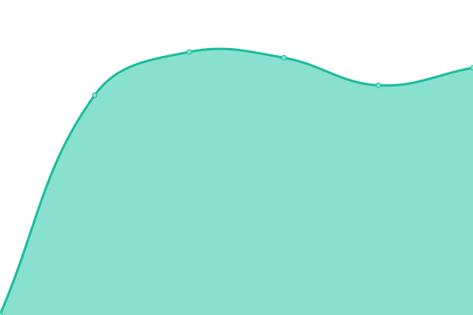
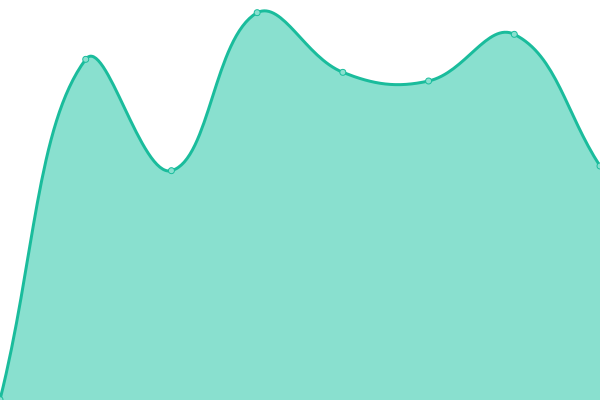

# [📈 Live Status](https://demo.upptime.js.org): <!--live status--> **🟥 Complete outage**

This repository contains the open-source uptime monitor and status page for [Upptime](https://upptime.js.org), powered by [Upptime](https://github.com/upptime/upptime).

With [Upptime](https://upptime.js.org), you can get your own unlimited and free uptime monitor and status page, powered entirely by a GitHub repository. We use [Issues](https://github.com/upptime/upptime/issues) as incident reports, [Actions](https://github.com/smdbngkt/uptime-serverku/actions) as uptime monitors, and [Pages](https://demo.upptime.js.org) for the status page.

<!--start: status pages-->
<!-- This summary is generated by Upptime (https://github.com/upptime/upptime) -->
<!-- Do not edit this manually, your changes will be overwritten -->
<!-- prettier-ignore -->
| URL | Status | History | Response Time | Uptime |
| --- | ------ | ------- | ------------- | ------ |
|  [SG-DO 1](http://sg-do1.dukun.org:81) | 🟥 Down | [sg-do-1.yml](https://github.com/smdbngkt/uptime-serverku/commits/HEAD/history/sg-do-1.yml) | 

 0ms
     
 | 

<a href="https://status.samid.dev/history/sg-do-1">0.00%</a>
    

|  [SG-DO2](http://sg-do4.dukun.org:81) | 🟥 Down | [sg-do-2.yml](https://github.com/smdbngkt/uptime-serverku/commits/HEAD/history/sg-do-2.yml) | 

 0ms
     
 | 

<a href="https://status.samid.dev/history/sg-do-2">0.00%</a>
    

|  [ID-GC](http://id-tc.dukun.org:89) | 🟥 Down | [id-gc.yml](https://github.com/smdbngkt/uptime-serverku/commits/HEAD/history/id-gc.yml) | 

 0ms
     
 | 

<a href="https://status.samid.dev/history/id-gc">0.00%</a>
    

|  [DUBAI-LN](http://dubai.dukun.org:89) | 🟥 Down | [dubai-ln.yml](https://github.com/smdbngkt/uptime-serverku/commits/HEAD/history/dubai-ln.yml) | 

 0ms
     
 | 

<a href="https://status.samid.dev/history/dubai-ln">0.00%</a>
    

<!--end: status pages-->

[**Visit our status website →**](https://demo.upptime.js.org)

## 📄 License

- Powered by: [Upptime](https://github.com/upptime/upptime)
- Code: [MIT](./LICENSE) © [Upptime](https://upptime.js.org)
- Data in the `./history` directory: [Open Database License](https://opendatacommons.org/licenses/odbl/1-0/)
